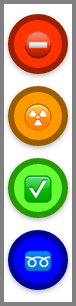

Tab Highlighter 
---
###Purpose
This Chrome extension is built for people who open multiple tabs regularly. The extension provides a quick solution to allow user to **highlight** tabs so that the certain tabs could be more recognizable.

###Features
  * **Highlight Tabs**
  * **Keyboard Shortcuts**
  * **Highlight Tabs History** for current session.
    * Automated Resotre the highlighted tabs if they were closed accidentally.
  * (History Page) - History page is not yet implemented.

###Installation
  * Get extension from Chrome App Store

###Screenshots

|    | notes |
|:--:|:----- |
|  | **BEFORE** highlighting |
|  | **AFTER** highlighting |
|  | View with multiple tabs opened |
|  | View with multiple tabs opened |
|  | Popup menu |

###Instruction

| Command/Shortcut | Action |
| :-----: | :----- |
| ALT + 1 | Highlight with color **RED** |
| ALT + 2 | Highlight with color **ORANGE** |
| ALT + 3 | Highlight with color **GREEN** |
| ALT + 4 | Highlight with color **BLUE** |

It is also possible to highlight tab through the **popup** page - Click extension icon on your tool bar.

###Library
  * <a href="https://blog.jquery.com/2015/07/13/jquery-3-0-and-jquery-compat-3-0-alpha-versions-released/">jQuery v3.0.0</a>

###Credit
  * <a href="http://blog.roomanna.com/09-24-2011/dynamically-coloring-a-favicon">Dynamically Coloring a Favicon by Arne Roomann-Kurrik</a>